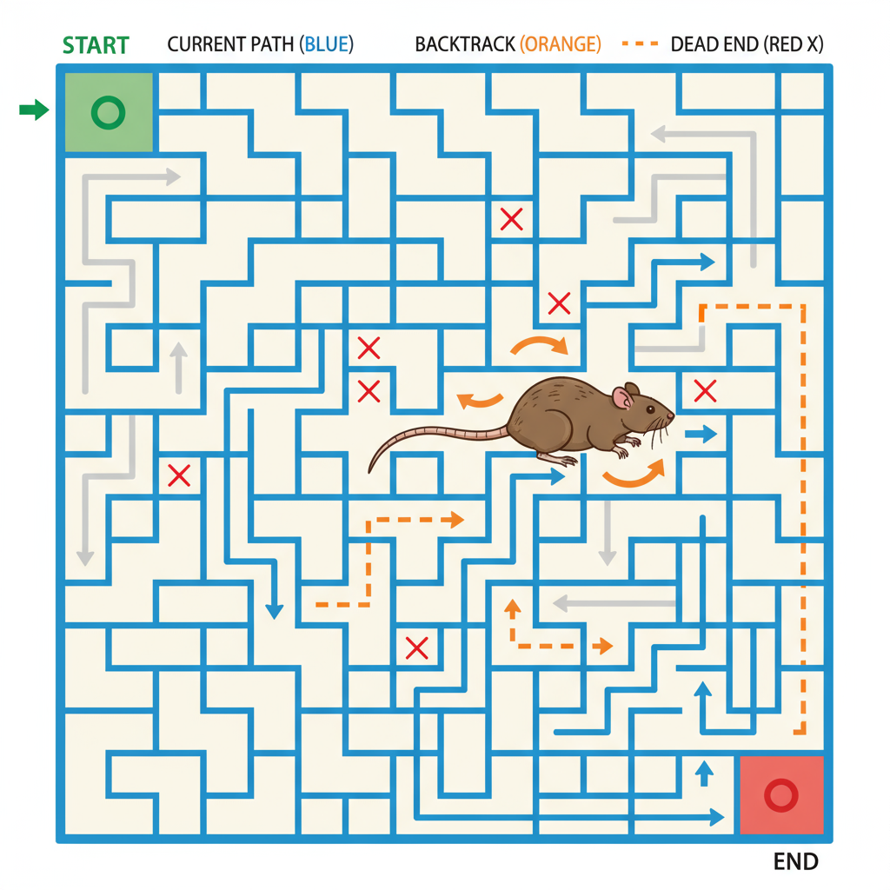

# Rat in a Maze Problem

<p align="center">
  
</p>


Make an image which shows the Rat in maze problem of backtracking in DSA

## Question Statement
You are given an **N × N square maze**, where each cell is either:  
- `1` → Open path (rat can move here)  
- `0` → Blocked path (rat cannot move here)  

The rat starts at the **top-left corner (0,0)** and needs to reach the **bottom-right corner (N-1,N-1)**.  

The rat can move in **4 possible directions**:  
- `D` → Down  
- `L` → Left  
- `R` → Right  
- `U` → Up  

The task is to **find all possible paths** the rat can take to reach the destination.  
Each path should be represented as a string consisting of characters `D, L, R, U`.

---

## Example

### Input
N = 4  

Maze =  
[
  [1, 0, 0, 0],  
  [1, 0, 0, 1],  
  [1, 1, 0, 0],  
  [0, 1, 1, 1]  ]


### Output

### Explanation
- `"DRDRR"` means: Down → Right → Down → Right → Right  
- `"DDRRR"` means: Down → Down → Right → Right → Right  

If no path exists, return an **empty list**.

---

## C++ Implementation

```cpp
#include <bits/stdc++.h>
using namespace std;

// Function to check if the next move is safe
bool Safe(int newX, int newY, vector<vector<int>> &arr, int n, vector<vector<bool>> &visited) {
    if ((newX >= 0 && newY >= 0) && (newX < n && newY < n) &&
        (arr[newX][newY] != 0) && (visited[newX][newY] == 0)) {
        return true;
    }
    return false;
}

// Recursive function to explore all paths
void solveMaze(int x, int y, vector<vector<int>> &arr, int n,
               vector<vector<bool>> &visited, vector<string> &ans, string path) {
    if (x == n - 1 && y == n - 1) {
        ans.push_back(path);
        return;
    }

    visited[x][y] = 1; // mark visited

    // Down
    if (Safe(x + 1, y, arr, n, visited)) {
        solveMaze(x + 1, y, arr, n, visited, ans, path + 'D');
    }

    // Left
    if (Safe(x, y - 1, arr, n, visited)) {
        solveMaze(x, y - 1, arr, n, visited, ans, path + 'L');
    }

    // Right
    if (Safe(x, y + 1, arr, n, visited)) {
        solveMaze(x, y + 1, arr, n, visited, ans, path + 'R');
    }

    // Up
    if (Safe(x - 1, y, arr, n, visited)) {
        solveMaze(x - 1, y, arr, n, visited, ans, path + 'U');
    }

    visited[x][y] = 0; // backtrack
}

// Main function to search paths
vector<string> searchMaze(vector<vector<int>> &arr, int n) {
    vector<string> ans;
    vector<vector<bool>> visited(n, vector<bool>(n, 0));
    if (arr[0][0] == 0) return ans;

    solveMaze(0, 0, arr, n, visited, ans, "");
    return ans;
}

int main() {
    int n = 4;
    vector<vector<int>> arr = {
        {1, 0, 0, 0},
        {1, 0, 0, 1},
        {1, 1, 0, 0},
        {0, 1, 1, 1}
    };

    vector<string> result = searchMaze(arr, n);

    for (auto &path : result) cout << path << " ";
    cout << endl;

    return 0;
}


