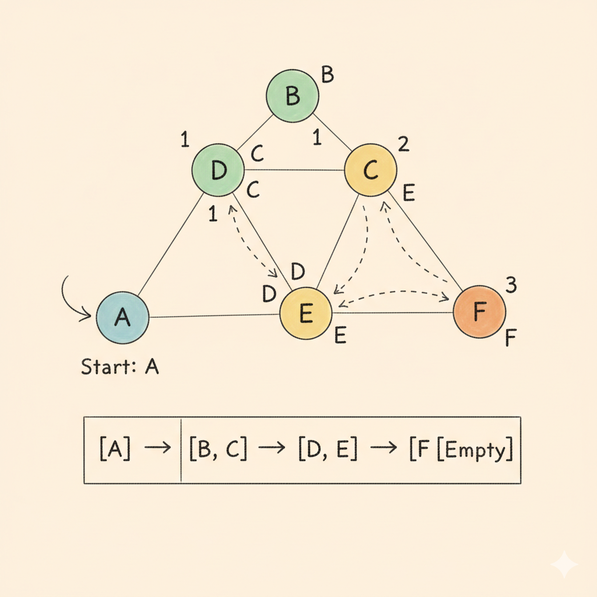

# Breadth-First Search (BFS) in Graph

<p align="center">
  
</p>

## What is BFS?
Breadth-First Search (BFS) is a **graph traversal algorithm** that explores nodes **level by level**.

- Start from a source node.  
- Visit all its neighbours.  
- Then move to the next level of neighbours.  

### Works well for:
- Undirected and unweighted graphs (like here).  
- Finding the shortest path in terms of number of edges.  

---

## 🔹 Example  
Graph edges:  
BFS starting from 0 → `0 1 2 3 4`

---

## ⏳ Time & Space Complexity  

| Operation              | Complexity |
|-------------------------|------------|
| **Time Complexity**     | `O(V + E)` |
| **Space Complexity**    | `O(V)`     |

- `V` = number of vertices (nodes).  
- `E` = number of edges.  

Explanation:  
- Each node and edge is processed once (`O(V + E)`).  
- Extra space for `visited[]` and `queue` → `O(V)`.

---

## 🔹 Note
This implementation includes `Disconnected_graph()` function, which ensures BFS traversal covers **all components** of the graph, not just the connected part.

---

## 🖥️ C++ Implementation

```cpp
#include <bits/stdc++.h>
using namespace std;

class graph {
public:
    unordered_map<int, list<int>> gr;   // adjacency list
    unordered_map<int, bool> visited;   // visited status of each node

    // Function to add an edge
    void edge(int u, int v, bool direction) {
        gr[u].push_back(v);
        if (direction == 0) {           // 0 means undirected
            gr[v].push_back(u);
        }
    }

    // BFS traversal
    void bfs(int start) {
        queue<int> value;
        value.push(start);
        visited[start] = true;

        while (!value.empty()) {
            int node = value.front();
            value.pop();

            cout << node << ' ';  // visit the node

            // traverse all neighbours
            for (auto i : gr[node]) {
                if (!visited[i]) {
                    value.push(i);
                    visited[i] = true;
                }
            }
        }
    }

    // Handles disconnected graph
    void Disconnected_graph() {
        for (auto &i : gr) {
            if (!visited[i.first]) {
                bfs(i.first);
            }
        }
    }
};

int main() {
    int nodes, edges;
    cout << "Enter the number of Nodes: ";
    cin >> nodes;

    cout << "Enter the number of Edges: ";
    cin >> edges;

    graph gr;

    cout << "Enter the edges (u v): " << endl;
    for (int i = 0; i < edges; i++) {
        int u, v;
        cin >> u >> v;
        gr.edge(u, v, 0);  // undirected graph
    }

    cout << "BFS Traversal: ";
    gr.Disconnected_graph();
    cout << endl;

    return 0;
}
