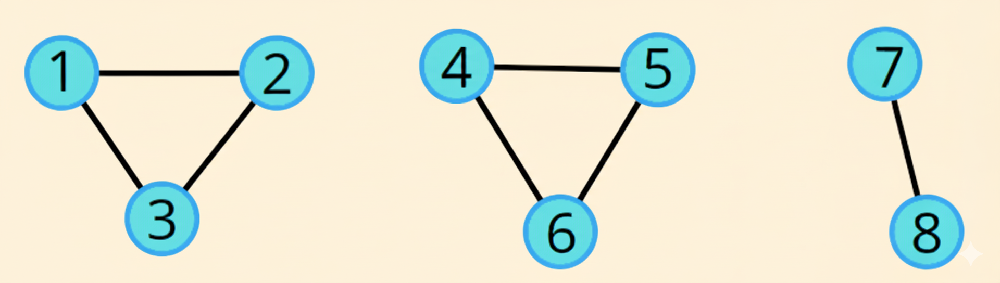

# Cycle Detection in an Undirected Graph using BFS

<p align="center">
  
</p>

## About the Code
This program checks whether a **cycle exists** in an **undirected graph** using **Breadth-First Search (BFS)**.

---

##  Key Components

### 1. Graph Representation
- Stored using `unordered_map<int, list<int>>`, which works as an **adjacency list**.  
- For an **undirected graph**, when an edge `(u, v)` is added, both `u → v` and `v → u` are stored.

### 2. Cycle Detection Logic (BFS)
- A `queue<int>` is used for BFS traversal.  
- A **parent map** keeps track of the node from which the current node was reached.  
- **Logic:** If a visited neighbor is **not the parent**, it indicates a cycle.

### 3. `Cycle()` Function
- Iterates over all graph nodes to handle **disconnected graphs**.  
- Calls `isCyle()` for **unvisited nodes**.  
- Prints whether a **cycle exists** or not.

### 4. Main Function
- Takes input for the **number of nodes and edges**.  
- Builds the graph with **user-input edges**.  
- Calls the `Cycle()` function to check for cycles.

---

## Time Complexity
| Step | Complexity |
|------|------------|
| Building the Graph | O(E) |
| BFS Traversal | O(V + E) |
| `Cycle()` function | O(V + E) overall |

**Overall:** `O(V + E)`

---

## Space Complexity
| Component | Space |
|-----------|-------|
| Adjacency List (`gr`) | O(V + E) |
| Visited Map | O(V) |
| Parent Map | O(V) |
| Queue (BFS) | O(V) in worst case |

**Overall:** `O(V + E)`

---

## C++ Implementation

```cpp
#include <bits/stdc++.h>
using namespace std;

class graph {
public:
    unordered_map<int,list<int>> gr;
    unordered_map<int, bool> visited;

    void edge(int u, int v, bool direction) {
        gr[u].push_back(v);
        if(direction == 0) { // undirected
            gr[v].push_back(u);
        }
    }

    bool isCyle(int start) {
        unordered_map<int,int> parent;
        queue<int> value;
        value.push(start);
        visited[start] = true;
        parent[start] = -1;

        while(!value.empty()) {
            int front = value.front();
            value.pop();

            for(auto neighbor: gr[front]) {
                if(visited[neighbor] == true && neighbor != parent[front]) {
                    return true;
                } else if(!visited[neighbor]) {
                    value.push(neighbor);
                    visited[neighbor] = true;
                    parent[neighbor] = front;
                }
            }
        }
        return false;
    }

    void Cycle() {
        bool ans;
        for(auto &i: gr) {
            if(!visited[i.first]) {
                ans = isCyle(i.first);
            }
        }

        if(ans == true) {
            cout << "Cycle exists";
        } else {
            cout << "Cycle does not exist";
        }
    }
};

int main() {
    int nodes, edges;
    cout << "Enter the number of Nodes: ";
    cin >> nodes;

    cout << "Enter the number of edges: ";
    cin >> edges;

    graph gr;
    for(int i = 0; i < edges; i++) {
        int u,v;
        cin >> u >> v;
        gr.edge(u,v,0);
    }

    gr.Cycle();
    return 0;
}
