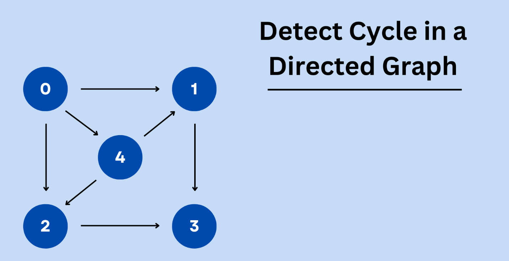

#  Cycle Detection in Directed Graph (BFS - Kahn’s Algorithm)

<p align="center">
  
</p>

---

##  Idea
- Kahn’s Algorithm is mainly used for **Topological Sorting**.  
- In a **Directed Acyclic Graph (DAG)**, a valid topological order always exists and contains all nodes.  
- If the graph has a **cycle**, then not all nodes will be included in the topological order (some nodes never reach in-degree 0).  
-  So, if the number of nodes in topo-order `< n`, a **cycle exists**.  

---

##  Time Complexity
- Computing in-degree → **O(m)** (where `m` = number of edges)  
- BFS traversal → **O(n + m)**  
 **Overall: O(n + m)**  

---

##  Space Complexity
- Adjacency list → **O(n + m)**  
- In-degree array → **O(n)**  
- Queue → **O(n)**  
 **Overall: O(n + m)**  

---

##  Code

```cpp
#include <bits/stdc++.h>
using namespace std;

class Graph {
    unordered_map<int, list<int>> adj;

public:
    void addEdge(int u, int v) {
        adj[u].push_back(v); // Directed edge
    }

    bool isCyclic(int n) {
        // Step 1: Compute in-degree of each node
        vector<int> in_degree(n, 0);
        for (auto &node : adj) {
            for (auto neighbour : node.second) {
                in_degree[neighbour]++;
            }
        }

        // Step 2: Push nodes with in-degree 0 into queue
        queue<int> q;
        for (int i = 0; i < n; i++) {
            if (in_degree[i] == 0) {
                q.push(i);
            }
        }

        // Step 3: Process nodes
        int count = 0; // count of visited nodes
        while (!q.empty()) {
            int front = q.front();
            q.pop();
            count++;

            for (auto neighbour : adj[front]) {
                in_degree[neighbour]--;
                if (in_degree[neighbour] == 0) {
                    q.push(neighbour);
                }
            }
        }

        // Step 4: If count != n, cycle exists
        return (count != n);
    }
};

int main() {
    int n, m;
    cout << "Enter number of nodes: ";
    cin >> n;
    cout << "Enter number of edges: ";
    cin >> m;

    Graph g;

    cout << "Enter edges (u v) for directed graph:\n";
    for (int i = 0; i < m; i++) {
        int u, v;
        cin >> u >> v;
        g.addEdge(u, v);
    }

    if (g.isCyclic(n))
        cout << "Graph contains a cycle\n";
    else
        cout << "Graph does not contain a cycle\n";

    return 0;
}
