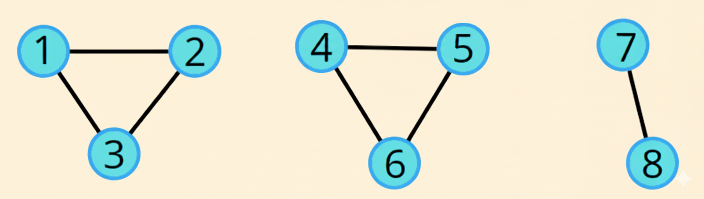

# Cycle Detection in an Undirected Graph using DFS

<p align="center">
  
</p>

##  About the Code
This program detects a **cycle** in an **undirected graph** using **Depth-First Search (DFS) recursively**.

---

##  Key Components

### 1. Graph Representation
- Stored using `unordered_map<int, list<int>>` (adjacency list).  
- `edge(u, v, direction)` adds an edge between `u` and `v`.  
- If `direction == 0`, the graph is **undirected** → edge is added in both directions.

### 2. Cycle Detection (DFS)
- `Cycle_dfs(int node, int parent)` is a recursive DFS function.  
- **Steps:**
  1. Mark the current node as visited.
  2. For each neighbor:
     - If **unvisited**, recursively call DFS with the current node as parent.
     - If **visited** and **not the parent**, a cycle exists.
- Returns `true` if a cycle is found, otherwise `false`.

### 3. Handling Disconnected Graphs
- The `cycle()` function iterates over all nodes.  
- Calls `Cycle_dfs()` for unvisited nodes to cover **disconnected components**.  
- Prints whether a **cycle exists** or not.

### 4. Main Function
- Takes input for **nodes** and **edges**.  
- Builds the graph using `edge()` function.  
- Calls `cycle()` to detect cycles.

---

##  Time Complexity
| Step | Complexity |
|------|------------|
| DFS Traversal | O(V) for nodes + O(E) for edges = O(V + E) |
| Handling Disconnected Graphs | O(V + E) overall |

** Overall Time Complexity:** `O(V + E)`

---

##  Space Complexity
| Component | Space |
|-----------|-------|
| Adjacency List (`gr`) | O(V + E) |
| Visited Map (`visited`) | O(V) |
| Recursion Stack (DFS) | O(V) in worst case |

** Overall Space Complexity:** `O(V + E)`

---

## C++ Implementation

```cpp
#include <bits/stdc++.h>
using namespace std;

class graph {
public:
    unordered_map<int, list<int>> gr;
    unordered_map<int, bool> visited;

    // Add edge
    void edge(int u, int v, bool direction) {
        gr[u].push_back(v);
        if (direction == 0) { // undirected
            gr[v].push_back(u);
        }
    }

    // DFS (recursive) for cycle detection
    bool Cycle_dfs(int node, int parent) {
        visited[node] = true;

        for (auto neighbor : gr[node]) {
            if (!visited[neighbor]) {
                bool ans = Cycle_dfs(neighbor, node);
                if(ans) return true;
            }
            else if(neighbor != parent) {
                return true;
            }
        }
        return false;
    }

    // DFS for disconnected graph
    void cycle() {
        bool ans;
        for(auto &i: gr){
            if(!visited[i.first]){
                ans = Cycle_dfs(i.first, -1);
            }
        }
        if(ans == true){
            cout << "Cycle exists";
        }
        else{
            cout << "Cycle does not exist";
        }
    }
};

int main() {
    int nodes;
    cout << "Enter the number of Nodes: ";
    cin >> nodes;
    
    int edges;
    cout << "Enter number of edges: ";
    cin >> edges;

    graph g;
    cout << "Enter edges (u v): ";
    for (int i = 0; i < edges; i++) {
        int u, v;
        cin >> u >> v;
        g.edge(u, v, 0); // undirected
    }

    g.cycle();
    cout << endl;

    return 0;
}
