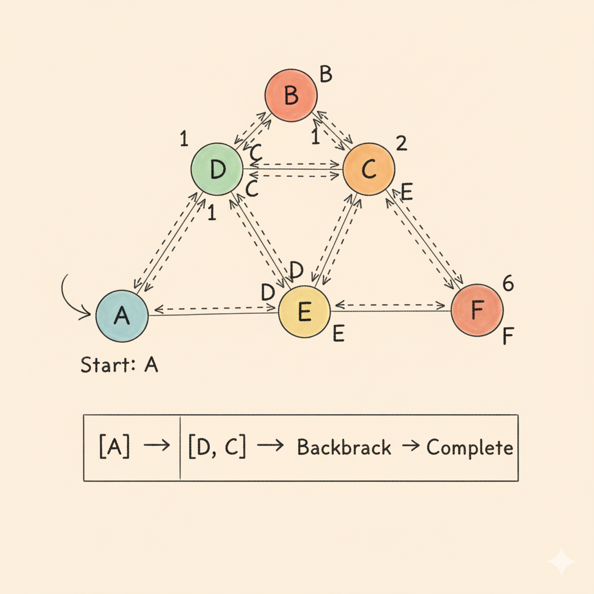

# Depth First Search (DFS) in Graph

<p align="center">
  
</p>

## What is DFS?
Depth First Search (DFS) is a **graph traversal algorithm** that explores as far as possible along each branch **before backtracking**.  

It can be implemented using **recursion** or an **explicit stack**.

---

## In an Undirected & Unweighted Graph
- DFS visits all nodes starting from a source node.  
- With a `Disconnected_dfs()` function, it ensures traversal of all **disconnected components**.  

---

## Traversal Style
- DFS goes **deep** into a branch (`neighbor → neighbor’s neighbor → …`) before moving to another branch.  
- The traversal order depends on adjacency list storage.  

---

## Time & Space Complexity  

| Operation              | Complexity |
|-------------------------|------------|
| **Time Complexity**     | `O(V + E)` |
| **Space Complexity**    | `O(V)`     |

- `V` = number of vertices.  
- `E` = number of edges.  
- Extra space due to recursion stack + visited map.  

---

## C++ Implementation

```cpp
#include <bits/stdc++.h>
using namespace std;

class graph {
public:
    unordered_map<int, list<int>> gr;   // adjacency list
    unordered_map<int, bool> visited;   // track visited nodes

    // Add edge
    void edge(int u, int v, bool direction) {
        gr[u].push_back(v);
        if (direction == 0) { // undirected
            gr[v].push_back(u);
        }
    }

    // DFS (recursive)
    void dfs(int node) {
        visited[node] = true;
        cout << node << " ";

        for (auto neighbour : gr[node]) {
            if (!visited[neighbour]) {
                dfs(neighbour);
            }
        }
    }

    // DFS for disconnected graph
    void Disconnected_dfs() {
        for (auto &i : gr) {
            if (!visited[i.first]) {
                dfs(i.first);
            }
        }
    }
};

int main() {
    int edges;
    cout << "Enter number of edges: ";
    cin >> edges;

    graph g;
    cout << "Enter edges (u v):\n";
    for (int i = 0; i < edges; i++) {
        int u, v;
        cin >> u >> v;
        g.edge(u, v, 0); // undirected
    }

    cout << "\nDFS Traversal: ";
    g.Disconnected_dfs();

    cout << endl;
    return 0;
}
