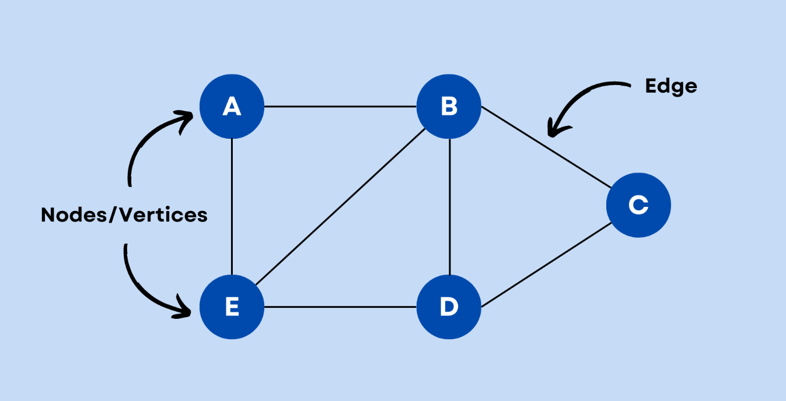

# What is a Graph?

<p align="center">
  
</p>

A **Graph** is a non-linear data structure that consists of **nodes (vertices)** connected by **edges**.  
Graphs are widely used to represent **networks** like social media, road maps, computer networks, etc.

---

##  Types of Graphs

### Based on Direction
- **Undirected Graph** → Edges have no direction (e.g., friendship relation).  
- **Directed Graph (Digraph)** → Edges have a direction (e.g., follower relation on Twitter).  

### Based on Weights
- **Unweighted Graph** → Edges don’t have weights (just connections).  
- **Weighted Graph** → Each edge has a cost/weight (e.g., distance, time).  

### Special Types
- **Cyclic Graph** → Contains at least one cycle.  
- **Acyclic Graph** → No cycles (e.g., Trees are acyclic).  
- **Connected Graph** → Every vertex can be reached from any other vertex.  
- **Disconnected Graph** → Some vertices cannot be reached.  

---

##  Graph Representation

1. **Adjacency Matrix** → 2D array, `O(V^2)` space.  
2. **Adjacency List** → Each vertex stores a list of neighbors, `O(V + E)` space.  

Your code uses **Adjacency List** with:  
```cpp
#include <bits/stdc++.h>
using namespace std;

class Graph {
public:
    unordered_map<int, list<int>> gr;

    // Function to add an edge
    void addEdge(int u, int v, bool direction) {
        gr[u].push_back(v);

        // If graph is undirected, add edge both ways
        if (direction == 0) {
            gr[v].push_back(u);
        }
    }

    // Function to print the graph
    void printGraph() {
        cout << "The Graph is given below: " << endl;
        for (auto i : gr) {
            cout << i.first << " -> ";
            for (auto j : i.second) {
                cout << j << ", ";
            }
            cout << endl;
        }
    }
};

int main() {
    int nodes, edges;
    cout << "Enter the number of Nodes: ";
    cin >> nodes;

    cout << "Enter the number of Edges: ";
    cin >> edges;

    Graph g;

    cout << "Enter the edges (u v): " << endl;
    for (int i = 0; i < edges; i++) {
        int u, v;
        cin >> u >> v;
        g.addEdge(u, v, 0);  // 0 means undirected
    }

    g.printGraph();

    return 0;
}

