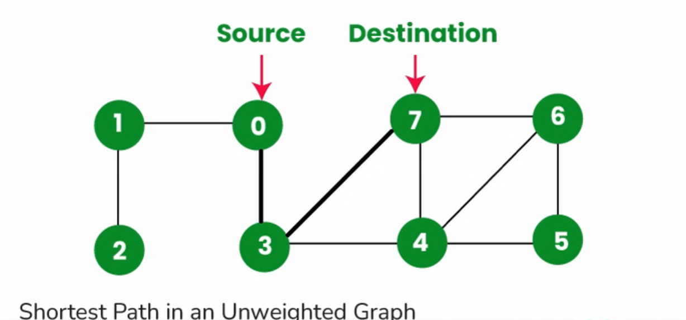

#  Shortest Path in an Undirected Graph (BFS)

<p align="center">
  
</p>


---

## Idea
- Use **Breadth-First Search (BFS)** since it explores level by level.  
- In an **unweighted graph**, BFS always gives the **shortest path** (minimum edges).  
- Keep track of:
  - `visited[]` → ensures nodes are processed only once.  
  - `parent[]` → to reconstruct the path from end → start.  

---

## Time Complexity
- Building adjacency list → **O(E)**  
- BFS traversal → **O(V + E)**  
- Path reconstruction → **O(V)** (worst case)  
 **Overall: O(V + E)**  

---

## Space Complexity
- Adjacency list → **O(V + E)**  
- `visited` + `parent` maps → **O(V)**  
- BFS queue → **O(V)**  
- Path vector → **O(V)**  
 **Overall: O(V + E)**  

---

##  Code

```cpp
// Shortest path in the Undirected Graph using BFS.
#include <bits/stdc++.h>
using namespace std;

class graph {
public:
    unordered_map<int, list<int>> gr;   // adjacency list
    unordered_map<int, bool> visited;   // visited tracker
    unordered_map<int, int> parent;     // parent mapping
    queue<int> qt;                      // BFS queue

    // Add an edge (u <-> v if undirected)
    void edge(int u, int v, bool direction) {
        gr[u].push_back(v);
        if (direction == 0) { // undirected
            gr[v].push_back(u);
        }
    }

    // BFS to find shortest path between start and end
    void shortest_path_bfs(int start, int end) {
        qt.push(start);
        visited[start] = true;
        parent[start] = -1;

        // BFS traversal
        while (!qt.empty()) {
            int front = qt.front();
            qt.pop();

            for (auto neighbour : gr[front]) {
                if (!visited[neighbour]) {
                    visited[neighbour] = true;
                    parent[neighbour] = front;
                    qt.push(neighbour);
                }
            }
        }

        // Reconstruct path from end → start
        vector<int> ans;
        int current = end;
        ans.push_back(current);

        while (current != start) {
            current = parent[current];
            ans.push_back(current);
        }

        reverse(ans.begin(), ans.end());

        // Print result
        cout << "The shortest path between " << start << " and " << end << ": ";
        for (int node : ans) {
            cout << node << " ";
        }
        cout << endl;
    }
};

int main() {
    int nodes, edges;
    cout << "Enter the number of Nodes: ";
    cin >> nodes;

    cout << "Enter the number of Edges: ";
    cin >> edges;

    graph gr;

    cout << "Enter edges (u v):" << endl;
    for (int i = 0; i < edges; i++) {
        int u, v;
        cin >> u >> v;
        gr.edge(u, v, 0);  // undirected edge
    }

    cout << "Start Node: ";
    int start;
    cin >> start;

    cout << "End Node: ";
    int end;
    cin >> end;

    cout << endl;

    gr.shortest_path_bfs(start, end);

    return 0;
}
