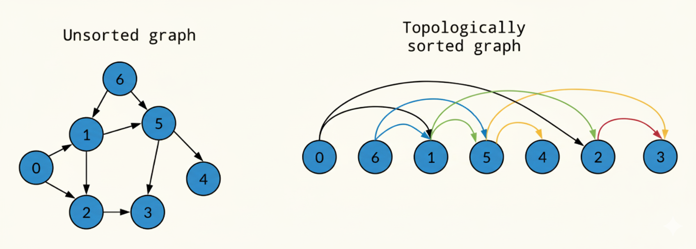

#  Topological Sort using DFS  

<p align="center">
  
</p>

##  Concept  
- Topological sorting is used **only for Directed Acyclic Graphs (DAG)**.  
- It gives a **linear ordering of vertices** such that for every directed edge `(u → v)`, vertex `u` appears before vertex `v`.  
- Implemented using **DFS + stack**.  

---


##  Example Input  

| **Number of Nodes** | **Number of Edges** |
|----------------------|----------------------|
| 6                    | 6                    |

**Edges (u → v):**  

| From (u) | To (v) |
|----------|--------|
| 5        | 0      |
| 5        | 2      |
| 4        | 0      |
| 4        | 1      |
| 2        | 3      |
| 3        | 1      |


**Output**  
Vertices in Topological Sort: 5 4 2 3 1 0


---

##  Time Complexity  
- DFS visits every vertex once → **O(V)**  
- Each edge is explored once → **O(E)**  
 **Total = O(V + E)**  

---

##  Space Complexity  
- Adjacency list → **O(V + E)**  
- Visited array → **O(V)**  
- Recursion stack + output stack → **O(V)**  
 **Total = O(V + E)**  

---

##  Code  

```cpp
// Topological Sorting in Graph using DFS
// Graph must be DAG (Directed Acyclic Graph).

#include <bits/stdc++.h>
using namespace std;

class graph {
public:
    unordered_map<int, list<int>> gr;   // adjacency list
    unordered_map<int, bool> visited;   // visited map
    stack<int> st;                      // stack to store topo order

    // Add directed edge u -> v
    void edge(int u, int v) {
        gr[u].push_back(v);
    }

    // DFS for topological sort
    void dfs_sort(int node) {
        visited[node] = true;

        for (auto neighbour : gr[node]) {
            if (!visited[neighbour]) {
                dfs_sort(neighbour);
            }
        }

        st.push(node); // push after exploring all neighbours
    }

    // Main function to perform Topological Sort
    void Topogocial_sort() {
        for (auto i : gr) {
            if (!visited[i.first]) {
                dfs_sort(i.first);
            }
        }

        cout << "Vertices in Topological Sort: ";
        while (!st.empty()) {
            cout << st.top() << " ";
            st.pop();
        }
        cout << endl;
    }
};

int main() {
    int nodes, edges;
    cout << "Enter the number of Nodes: ";
    cin >> nodes;
    cout << "Enter number of edges: ";
    cin >> edges;

    graph g;
    cout << "Enter edges (u v): ";
    for (int i = 0; i < edges; i++) {
        int u, v;
        cin >> u >> v;
        g.edge(u, v);
    }

    g.Topogocial_sort();
    return 0;
}
