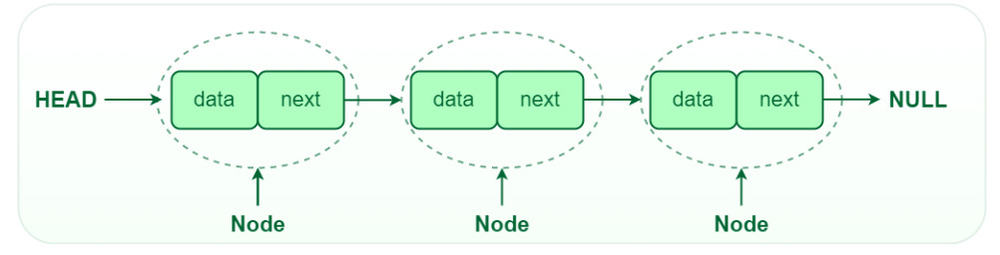

# Singly Linked List

<p align="center">
  
</p>


A singly linked list is a dynamic linear data structure composed of nodes, where each node holds data and a pointer to the next node; access is sequential rather than by index.  

Operations’ costs vary by position and by whether a tail pointer is maintained:  
- Head operations are typically **O(1)**  
- Arbitrary-position operations include a traversal step of **O(n)**  
- Maintaining a tail pointer makes appending **O(1)** but does not change tail deletion in a singly linked list.  

---

## ✅ Advantages

- **Dynamic size**: Nodes can be added/removed without reallocating contiguous memory, which suits workloads with unknown or varying sizes.  
- **Efficient local updates**: Insertions/deletions at the head are **O(1)**, and after a position/node is located, relinking is **O(1)**, avoiding costly shifts required by arrays.  
- **Memory flexibility**: Does not require contiguous memory, reducing wasted space compared with over-provisioned arrays.  
- **Useful building block**: Natural fit for stacks, queues, and concatenation tasks where frequent edge insertions/deletions occur.  

---

## ⏱️ Time Complexity

| Operation | Time Complexity |
|-----------|-----------------|
| Insertion at head | **O(1)** |
| Insertion at tail (no tail pointer) | **O(n)** due to traversal to last node |
| Insertion at tail (with tail pointer) | **O(1)** by updating `tail->next` and `tail` |
| Insertion at any position by index | **O(n)** to reach position-1, then **O(1)** relink; overall **O(n)** |
| Deletion at head | **O(1)** by moving head |
| Deletion at tail (no tail pointer) | **O(n)** to find second-last node |
| Deletion at tail (with tail pointer only) | **O(n)** in singly linked list because the previous node must still be found |
| Deletion at any position by index | **O(n)** to reach previous node, then **O(1)** unlink; overall **O(n)** |
| Traversal (print/scan) | **O(n)** to visit each node once |

> **Note**: If a direct reference to the node and its predecessor is already available, insertion or deletion at that location is **O(1)**.  
The search/traversal cost is what drives the overall **O(n)** in the general case.  

---

## 💻 C++ Implementation

Below is a C++ implementation of a singly linked list supporting insertion (head, tail, any index), deletion (any index with head/tail maintenance), and traversal printing.  

It maintains head and an optional tail pointer so that appends are **O(1)** while deletions at the tail remain **O(n)** in a singly linked list due to the need to find the predecessor.  

```cpp
// Singly Linked List (Insertion, Deletion and Printing via traversal)

#include<bits/stdc++.h>
using namespace std;

class Node{                    // Class Node to make a Node for the Linked list.
public:
    int data;
    Node *next;

    Node(int data){
        this->data = data;
        this->next = NULL;
    }

    // Destructor
    ~Node(){
        int val = this->data;
        if(this->next != NULL){
            delete next;
            this->next = NULL;
        }
        cout << val << " This node value is freed" << endl;
    }
};

void insertAthead(Node* &head, int d){      // Insert a Node at the head
    Node* temp = new Node(d);
    temp->next = head;
    head = temp;
}

void insertAttail(Node* &tail, int d){      // Insert a Node at the tail (requires tail pointer)
    Node* temp = new Node(d);
    tail->next = temp;
    tail = temp;
}

void insertAtAnyLocation(Node* &head, Node* &tail, int position, int data){
    // For inserting at head position
    if(position == 1){
        insertAthead(head, data);
        return;
    }

    Node* temp = head;
    int cnt = 1;
    
    while(cnt < position-1){
        temp = temp->next;
        cnt++;
    }
    // For inserting at tail position if after traversal we reach at last position
    if(temp->next == NULL) {
        insertAttail(tail, data);
        return;
    }

    Node* n1 = new Node(data);
    n1->next = temp->next;
    temp->next = n1;
}

void Deletion(int position, Node* &Head, Node* &Tail){  // Deleting Node at any place.
    if(position == 1){
        Node* temp = Head;
        Head = temp->next;
        temp->next = NULL;
        delete temp;
        return;
    }

    int count = 1;
    Node* curr = Head;
    Node* prev = NULL;

    while(count < position){
        prev = curr;
        curr = curr->next;
        count++;
    }

    if(curr->next == NULL){   // Updating the Tail pointer.
        Tail = prev;
    }

    prev->next = curr->next;
    curr->next = NULL;
    delete curr;
}

void display(Node* &head){                 // Display nodes by traversing
    Node* temp = head;
    while(temp != NULL){
        cout << temp->data << "->";
        temp = temp->next;
    }
    cout << "NULL" << endl;
}

int main() {
    Node *N1 = new Node(10);
    
    // Head pointer
    Node *head = N1;
    display(head);

    // Tail pointer
    Node* tail = N1;

    insertAttail(tail, 20);
    insertAttail(tail, 30);
    insertAttail(tail, 40);
    insertAttail(tail, 50);
    insertAttail(tail, 60);
    display(head);

    insertAtAnyLocation(head, tail, 3, 22);
    display(head);

    Deletion(3, head, tail);
    display(head);

    Deletion(6, head, tail);
    display(head);

    Deletion(1, head, tail);
    display(head);

    cout << "Head points to: " << head->data << endl;
    cout << "Tail points to: " << tail->data;

    return 0;
}
