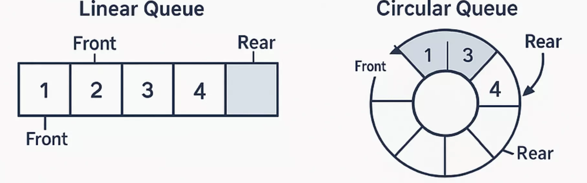

# Circular Queue Implementation Using Array

<p align="center">
  
</p>

## Overview
A **circular queue** implements the **FIFO (First In, First Out)** principle using a fixed-size array with two pointers (`front` and `rear`) that can **wrap around** to the beginning when they reach the end of the array.  

This circular nature solves the major limitation of linear queues where empty spaces at the beginning cannot be reused after dequeue operations, leading to inefficient memory usage.

---

## Advantages
- **Efficient memory utilization:** Eliminates wasted space by reusing memory locations freed by dequeue operations.  
- **No memory shifting required:** Elements don’t need to be shifted after dequeue operations, maintaining constant-time performance.  
- **Fixed memory allocation:** Uses a predetermined amount of memory, making memory management predictable.  
- **Constant time operations:** All core operations (enqueue, dequeue, peek) execute in **O(1)** time regardless of queue size.  
- **Better performance:** Ideal for applications with frequent enqueue/dequeue operations compared to linear queues.  

---

## Disadvantages
- **Fixed capacity limitation:** Cannot grow beyond the initial size, leading to overflow when full.  
- **Complex implementation:** Requires careful logic for wraparound and distinguishing between empty/full states.  
- **Difficult resizing:** Expanding or shrinking requires complex memory reallocation.  
- **Debugging complexity:** Circular nature makes error detection harder.  
- **Careful pointer management:** Precise handling of `front` and `rear` is required to prevent corruption of queue state.  

---

## Time Complexity

All fundamental circular queue operations achieve optimal constant-time performance using modular arithmetic.

| Operation   | Time Complexity | Description |
|-------------|-----------------|-------------|
| Enqueue     | **O(1)**        | Insert at rear position with wraparound |
| Dequeue     | **O(1)**        | Remove from front position with wraparound |
| Peek/Front  | **O(1)**        | Access element at front index |
| isEmpty     | **O(1)**        | Check if `front == -1` |
| isFull      | **O(1)**        | Check wraparound condition |
| Display     | **O(n)**        | Traverse all elements |

> **Note:** Space complexity is **O(n)** where *n* is the fixed capacity of the queue.

---

## Code

Below is a **C++ implementation** of a circular queue with enqueue, dequeue, peek, isEmpty, isFull, and display operations, including error handling.  
It uses **modular arithmetic** for wraparound behavior and condition checks to distinguish between empty and full states.

```cpp
#include <iostream>
using namespace std;

class CircularQueue {
private:
    int *arr;
    int front;
    int rear;
    int size;

public:
    CircularQueue(int n) {
        size = n;
        arr = new int[size];
        front = -1;
        rear = -1;
    }

    // Check if queue is full
    bool isFull() {
        return (front == 0 && rear == size - 1) || (rear == (front - 1) % (size - 1));
    }

    // Check if queue is empty
    bool isEmpty() {
        return front == -1;
    }

    // Insert element
    void enqueue(int value) {
        if (isFull()) {
            cout << "Queue is Full\n";
            return;
        }
        if (front == -1) { // first element
            front = rear = 0;
            arr[rear] = value;
        }
        else if (rear == size - 1 && front != 0) { // wrap around
            rear = 0;
            arr[rear] = value;
        }
        else {
            rear++;
            arr[rear] = value;
        }
    }

    // Delete element
    void dequeue() {
        if (isEmpty()) {
            cout << "Queue is Empty\n";
            return;
        }
        cout << "Deleted: " << arr[front] << endl;

        if (front == rear) { // single element
            front = rear = -1;
        }
        else if (front == size - 1) {
            front = 0; // wrap around
        }
        else {
            front++;
        }
    }

    // Peek front element
    int peek() {
        if (isEmpty()) {
            cout << "Queue is Empty\n";
            return -1;
        }
        return arr[front];
    }

    // Display queue elements
    void display() {
        if (isEmpty()) {
            cout << "Queue is Empty\n";
            return;
        }
        cout << "Queue elements: ";
        if (rear >= front) {
            for (int i = front; i <= rear; i++)
                cout << arr[i] << " ";
        }
        else {
            for (int i = front; i < size; i++)
                cout << arr[i] << " ";
            for (int i = 0; i <= rear; i++)
                cout << arr[i] << " ";
        }
        cout << endl;
    }
};

int main() {
    CircularQueue q(5);

    q.enqueue(10);
    q.enqueue(20);
    q.enqueue(30);
    q.enqueue(40);
    q.enqueue(50);

    q.display();

    q.dequeue();
    q.dequeue();

    q.display();

    q.enqueue(60);
    q.enqueue(70);

    q.display();

    cout << "Front element: " << q.peek() << endl;

    return 0;
}
