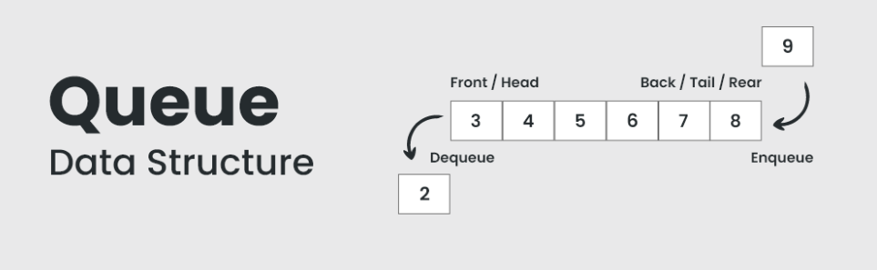

# Linear Queue Implementation Using Array

<p align="center">
  
</p>

## Overview
A **linear queue** is a straightforward implementation of the queue data structure using an array, where elements are added at the **rear** end and removed from the **front** end in a strictly sequential manner.  
The queue uses two pointers:  
- **front** → points to the first element  
- **rear** → points to the last element  

Both pointers move forward as operations are performed, **never wrapping around**.

---

## Advantages
- **Simple implementation:** Easy to understand and code with straightforward logic, making it ideal for beginners.  
- **Predictable behavior:** Processes elements in strict **FIFO** order, ensuring predictability.  
- **Fast operations:** Core operations (enqueue, dequeue, peek) execute in **O(1)**.  
- **Direct array access:** Benefits from cache locality and direct indexing.  
- **Fixed memory allocation:** Uses predetermined memory size, avoiding dynamic allocation overhead.  

---

## Disadvantages
- **Memory wastage:** Freed space at the front after dequeue cannot be reused.  
- **False overflow:** Queue may appear full even when space is available at the beginning.  
- **Fixed capacity limitation:** Cannot grow beyond initial size.  
- **No random access:** Only the front element can be accessed directly.  
- **Static size declaration:** May lead to wasted space or insufficient capacity.  

---

## Time Complexity

| Operation   | Time Complexity | Description |
|-------------|-----------------|-------------|
| Enqueue     | **O(1)**        | Insert at rear index and increment rear |
| Dequeue     | **O(1)**        | Remove from front index and increment front |
| Peek/Front  | **O(1)**        | Access element at front index |
| isEmpty     | **O(1)**        | Check if rear equals front |
| isFull      | **O(1)**        | Check if rear equals array size |
| Display     | **O(n)**        | Traverse from front to rear |

> **Note:** Space complexity is **O(n)** where *n* is the array capacity. However, actual usable space decreases as the front pointer advances.

---

## Code

Below is a **C++ implementation** of a linear queue using an array with enqueue, dequeue, peek, isEmpty, and isFull operations, including error handling.  
It uses a **reset mechanism** where both pointers return to 0 when the queue becomes empty, partially addressing memory wastage.

```cpp
// Queue implemented through array.

#include<bits/stdc++.h>
using namespace std;

class Queue {
public: 
    int rear;
    int front;
    int* arr;
    int size;

    Queue() {
        size = 10000;
        rear = 0;
        front = 0;
        arr = new int[size];
    }

    void enqueue(int data) {
        if (rear == size) {
            cout << "Queue is full" << endl;
        }
        else {
            arr[rear] = data;
            rear++;
        }
    }

    void dequeue() {
        if (rear == front) {
            cout << "Queue is empty" << endl;
        }
        else {
            arr[front] = -1; // optional marker
            front++;

            if (rear == front) { // reset when empty
                rear = 0;
                front = 0;
            }
        }
    }

    bool isEmpty() {
        return rear == front;
    }

    bool isFull() {
        return rear == size;
    }

    void getfront() {
        if (isEmpty()) {
            cout << "Queue is empty" << endl;
        }
        else {
            cout << "Front value: " << arr[front] << endl;
        }
    }

    ~Queue() {
        delete[] arr;
    }
};

int main() {
    Queue qt;
    qt.isEmpty();
    qt.isFull();
    qt.enqueue(10);
    qt.enqueue(20);
    qt.enqueue(30);

    qt.getfront();
    qt.dequeue();
    qt.getfront();

    return 0;
}
