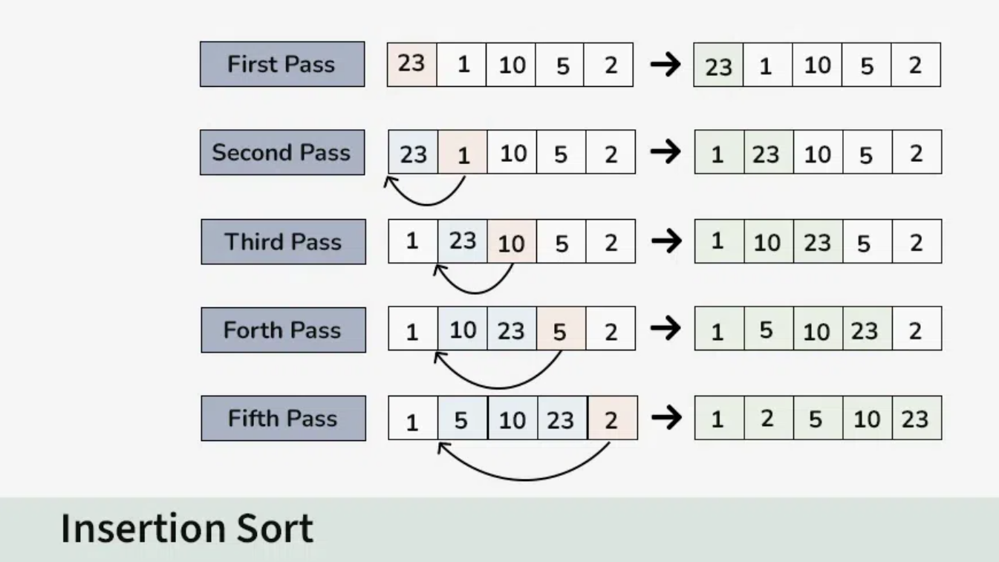

#  Insertion Sort (C++)

<p align="center">
  
</p>

##  Concept

**Insertion Sort** works just like sorting cards in your hand:  
You pick one card at a time and insert it into its correct position among the already sorted cards on your left.

It builds the **sorted array one element at a time**.

---
| Case        | Time Complexity | Explanation      |
| ----------- | --------------- | ---------------- |
| **Best**    | O(n)            | Already sorted   |
| **Average** | O(n²)           | Typical case     |
| **Worst**   | O(n²)           | Reverse order    |
| **Space**   | O(1)            | In-place sorting |


---

##  How It Works

1. Assume the **first element** is already sorted.  
2. Pick the **next element (key)** and compare it with all elements before it.  
3. **Shift** larger elements one position ahead to make space.  
4. Insert the **key** in the correct position.  
5. Repeat until all elements are sorted.

---

##  Code

```cpp
#include <bits/stdc++.h>
using namespace std;

void insertionSort(vector<int>& arr) {
    int n = arr.size();

    for (int i = 1; i < n; i++) {
        int key = arr[i];      // element to insert
        int j = i - 1;

        // shift elements greater than key one step ahead
        while (j >= 0 && arr[j] > key) {
            arr[j + 1] = arr[j];
            j--;
        }

        arr[j + 1] = key;      // insert key at correct position
    }
}

int main() {
    vector<int> arr = {12, 11, 13, 5, 6};

    cout << "Before sorting: ";
    for (int x : arr) cout << x << " ";
    cout << endl;

    insertionSort(arr);

    cout << "After sorting: ";
    for (int x : arr) cout << x << " ";
    cout << endl;

    return 0;
}
