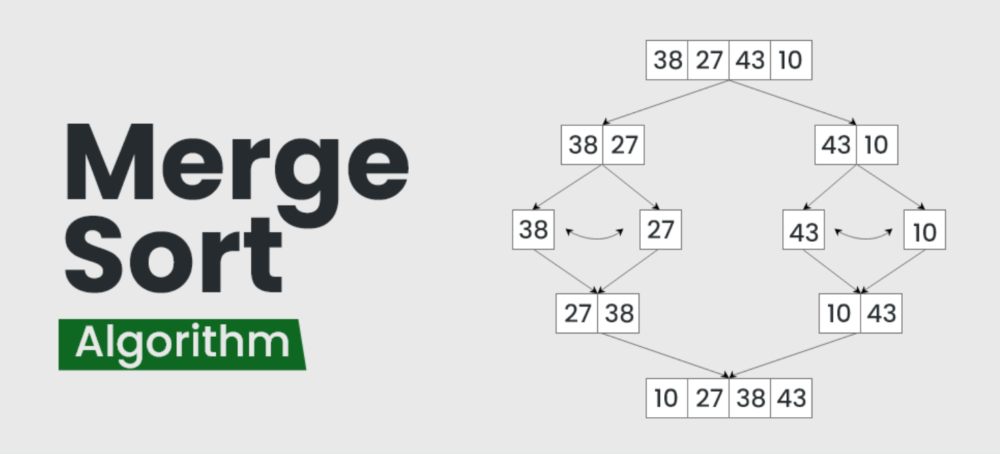

#  Merge Sort (C++)

<p align="center">
  
</p>

##  Concept

**Merge Sort** is a **Divide and Conquer** sorting algorithm.  
It divides the array into smaller subarrays, sorts each part recursively,  
and then **merges** them back together in sorted order.

---

##  How It Works

1. **Divide:** Split the array into two halves (left and right).  
2. **Conquer:** Recursively sort both halves.  
3. **Combine:** Merge the two sorted halves into one sorted array.

---
| Case        | Time Complexity | Explanation                                |
| ----------- | --------------- | ------------------------------------------ |
| **Best**    | O(n log n)      | Recursive division                         |
| **Average** | O(n log n)      | Always divides in halves                   |
| **Worst**   | O(n log n)      | Consistent recursion depth                 |
| **Space**   | O(n)            | Extra space for merging                    |
| **Stable**  | ✅ Yes           | Maintains relative order of equal elements |


---

##  Code

```cpp
#include <bits/stdc++.h>
using namespace std;

void merge(vector<int> &arr, int left, int mid, int right) {
    vector<int> temp;
    int i = left, j = mid + 1;

    // merge both halves in sorted order
    while (i <= mid && j <= right) {
        if (arr[i] <= arr[j])
            temp.push_back(arr[i++]);
        else
            temp.push_back(arr[j++]);
    }

    // copy remaining elements
    while (i <= mid) temp.push_back(arr[i++]);
    while (j <= right) temp.push_back(arr[j++]);

    // copy back to original array
    for (int k = left; k <= right; k++) {
        arr[k] = temp[k - left];
    }
}

void mergeSort(vector<int> &arr, int left, int right) {
    if (left >= right) return; // base case

    int mid = left + (right - left) / 2;

    // divide
    mergeSort(arr, left, mid);
    mergeSort(arr, mid + 1, right);

    // conquer (merge sorted halves)
    merge(arr, left, mid, right);
}

int main() {
    vector<int> arr = {38, 27, 43, 3, 9, 82, 10};

    cout << "Before sorting: ";
    for (int x : arr) cout << x << " ";
    cout << endl;

    mergeSort(arr, 0, arr.size() - 1);

    cout << "After sorting: ";
    for (int x : arr) cout << x << " ";
    cout << endl;

    return 0;
}
