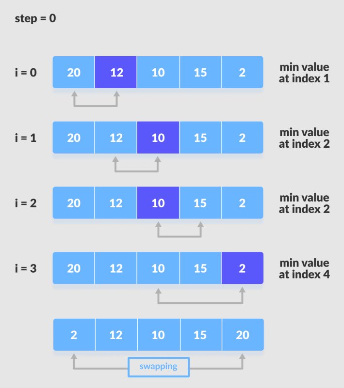

#  Selection Sort (C++)

<p align="center">
  
</p>

##  Concept

**Selection Sort** works by repeatedly selecting the **smallest (or largest)** element from the **unsorted** part of the array  
and placing it at the **beginning** of the sorted part.

It divides the array into two parts:
- ✅ **Sorted part** (left side)  
- 🔄 **Unsorted part** (right side)

---

##  How It Works

1. Start from index `0`.  
2. Find the **minimum element** in the unsorted portion (`i → n-1`).  
3. **Swap** it with the element at index `i`.  
4. Move the boundary one step right.  
5. Repeat until the entire array is sorted.

---
| Case        | Time Complexity | Explanation                     |
| ----------- | --------------- | ------------------------------- |
| **Best**    | O(n²)           | Comparisons always required     |
| **Average** | O(n²)           | Always scans unsorted part      |
| **Worst**   | O(n²)           | Reverse order                   |
| **Space**   | O(1)            | In-place sorting                |
| **Stable**  |  No            | Equal elements may change order |


---

##  Code

```cpp
#include <bits/stdc++.h>
using namespace std;

void selectionSort(vector<int>& arr) {
    int n = arr.size();

    for (int i = 0; i < n - 1; i++) {
        int minIndex = i;

        // find the index of the smallest element
        for (int j = i + 1; j < n; j++) {
            if (arr[j] < arr[minIndex]) {
                minIndex = j;
            }
        }

        // swap the found minimum element with the first element
        swap(arr[i], arr[minIndex]);
    }
}

int main() {
    vector<int> arr = {64, 25, 12, 22, 11};

    cout << "Before sorting: ";
    for (int x : arr) cout << x << " ";
    cout << endl;

    selectionSort(arr);

    cout << "After sorting: ";
    for (int x : arr) cout << x << " ";
    cout << endl;

    return 0;
}
