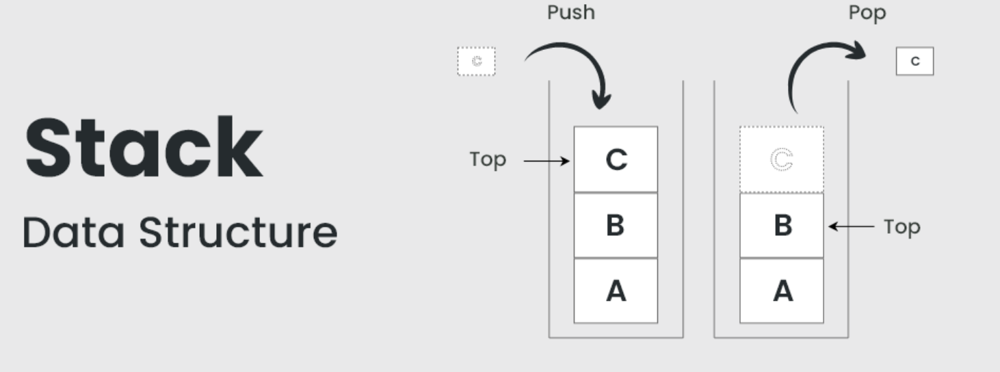

# Stack Implementation Using Linked List
<p align="center">
  
</p>

## Overview
A stack implemented using a linked list stores elements in **nodes** that are dynamically created and linked together, with the **top pointer** serving as the head of the list.  
Unlike array-based stacks, this implementation has no predefined size limit and can expand until system memory is exhausted, making it suitable for applications with unpredictable stack sizes.

---

## Advantages
- **Dynamic size:** Can grow and shrink during runtime without predefined capacity limits, preventing stack overflow in most practical scenarios.  
- **Efficient memory usage:** Allocates memory only for actual elements stored, eliminating waste from pre-allocated unused space.  
- **No overflow risk:** Overflow occurs only when system memory is exhausted, not due to capacity constraints.  
- **Flexible memory allocation:** Nodes can be stored anywhere in memory, not requiring contiguous blocks like arrays.  

---

## Disadvantages
- **Extra memory overhead:** Each node requires additional memory for storing the `next` pointer, increasing total memory consumption.  
- **Complex implementation:** More intricate than array-based stacks due to dynamic memory allocation and pointer manipulation.  
- **Poor cache performance:** Non-contiguous memory allocation leads to cache misses and potentially slower performance compared to arrays.  
- **No random access:** Cannot directly access elements by index; requires traversal from the top.  
---

## Time Complexity
All fundamental stack operations achieve optimal constant-time performance through direct pointer manipulation.

| Operation | Time Complexity | Description |
|-----------|-----------------|-------------|
| Push      | **O(1)**        | Create new node and update top pointer |
| Pop       | **O(1)**        | Update top pointer and delete node |
| Peek/Top  | **O(1)**        | Access data at top node |
| isEmpty   | **O(1)**        | Check if top pointer is null |
| Display   | **O(n)**        | Traverse all nodes to print |

> **Note:** Space complexity is **O(n)** where *n* is the number of elements actually stored, plus pointer overhead per node.

---

## Code

Below is a **C++ implementation** of a linked list-based stack with push, pop, peek, isEmpty, and display operations, including underflow error handling.  
The implementation uses a `top` pointer as the head of the linked list, with new elements added at the front and removed from the front to maintain **LIFO** behavior.

```cpp
#include <iostream>
using namespace std;

// Node structure
class Node {
public:
    int data;
    Node* next;
    Node(int value) {
        data = value;
        next = nullptr;
    }
};

// Stack class using linked list
class Stack {
    Node* top;  // pointer to top of stack
public:
    Stack() {
        top = nullptr;
    }
    
    // Push element onto stack
    void push(int value) {
        Node* newNode = new Node(value);
        newNode->next = top; // link new node to previous top
        top = newNode;       // update top
        cout << value << " pushed to stack\n";
    }
    
    // Pop element from stack
    void pop() {
        if (top == nullptr) {
            cout << "Stack Underflow! Cannot pop.\n";
            return;
        }
        Node* temp = top;
        cout << "Popped: " << temp->data << endl;
        top = top->next; // move top to next node
        delete temp;     // free memory
    }
    
    // Peek top element
    void peek() {
        if (top == nullptr) {
            cout << "Stack is empty\n";
            return;
        }
        cout << "Top element: " << top->data << endl;
    }
    
    // Check if stack is empty
    bool isEmpty() {
        return top == nullptr;
    }
    
    // Display stack
    void display() {
        if (top == nullptr) {
            cout << "Stack is empty\n";
            return;
        }
        cout << "Stack elements: ";
        Node* temp = top;
        while (temp != nullptr) {
            cout << temp->data << " ";
            temp = temp->next;
        }
        cout << endl;
    }
};

// Driver code
int main() {
    Stack s;
    s.push(10);
    s.push(20);
    s.push(30);
    s.display();
    s.peek();
    s.pop();
    s.display();
    s.pop();
    s.pop();
    s.pop(); // trying to pop from empty stack
    return 0;
}
