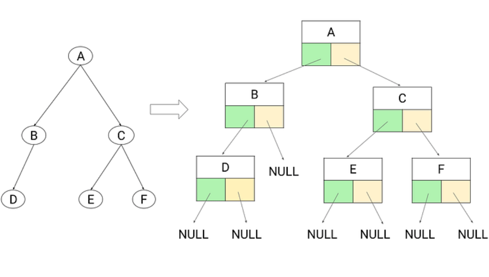

# Introduction to Tree and Traversals

<p align="center">
  
</p>

## What is a Tree?
A **Tree** is a non-linear hierarchical data structure consisting of nodes.

- The **topmost node** is called the **Root**.  
- Each node contains data and links (edges) to its child nodes.  
- A **Binary Tree** is a special type of tree where each node has at most **2 children** (called left and right child).

---

## Why Do We Use Trees?
Trees are widely used because:

1. **Hierarchical Structure Representation**  
   - Perfect for representing hierarchical data like filesystems, XML/HTML DOM, organizational charts.

2. **Efficient Searching**  
   - Binary Search Tree (BST) enables `O(log N)` search, insert, and delete operations (when balanced).

3. **Routing and Networking**  
   - Used in routers, network protocols, and shortest path algorithms.

4. **Database Indexing**  
   - B-Trees, B+ Trees are used in databases for efficient indexing and retrieval.

5. **Expression Parsing**  
   - Expression trees are used to evaluate arithmetic expressions and in compilers.

**In short:** Trees provide an organized and efficient way to store and process hierarchical or sorted data.

---

## Different Types of Trees
- **General Tree** → Each node can have any number of children.  
- **Binary Tree** → Each node has at most 2 children.  
- **Full Binary Tree** → Every node has either 0 or 2 children.  
- **Complete Binary Tree** → All levels are filled except possibly the last, which is filled left to right.  
- **Perfect Binary Tree** → All internal nodes have 2 children, and all leaves are at the same level.  
- **Balanced Binary Tree** → Height difference between left and right subtree is ≤ 1.  
  - Example: AVL Tree  

### Special Trees
- **Binary Search Tree (BST)** → Left child < Root < Right child. (Inorder = Sorted order)  
- **AVL Tree** → Self-balancing BST with balance factor = {-1, 0, 1}.  
- **Red-Black Tree** → Self-balancing BST using coloring property.  
- **B-Tree / B+ Tree** → Used in databases for indexing.  
- **N-ary Tree** → Each node can have up to N children.  

---

## Traversals in Binary Tree
Traversal = visiting each node exactly once in some order.

### 1. Level Order Traversal (Breadth-First Search)
- Visit nodes **level by level** (top to bottom, left to right).  
- Uses a **queue**.  
- **Time Complexity:** `O(N)`  
- **Space Complexity:** `O(N)`  

Example: `[1,2,3,4,5] → 1 2 3 4 5`

---

### 2. Inorder Traversal (Left → Root → Right)
- Visit left subtree, then root, then right subtree.  
- In BST, gives **sorted order**.  
- **Time Complexity:** `O(N)`  
- **Space Complexity:** `O(H)` (H = tree height)  

Example: `[1,2,3] → 2 1 3`

---

### 3. Preorder Traversal (Root → Left → Right)
- Visit root, then left subtree, then right subtree.  
- Useful for copying/serializing a tree.  
- **Time Complexity:** `O(N)`  
- **Space Complexity:** `O(H)`  

Example: `[1,2,3] → 1 2 3`

---

### 4. Postorder Traversal (Left → Right → Root)
- Visit left subtree, then right subtree, then root.  
- Useful for deleting/freeing memory.  
- **Time Complexity:** `O(N)`  
- **Space Complexity:** `O(H)`  

Example: `[1,2,3] → 2 3 1`

---

## Example Code (C++)

```cpp
#include <bits/stdc++.h>
using namespace std;

// Node class
class Node {
public:
    int data;
    Node* left;
    Node* right;

    Node(int data) {
        this->data = data;
        this->left = NULL;
        this->right = NULL;
    }
};

// Build tree using recursion
Node* BuildTree(Node* root) {
    int element;
    cout << "Enter the data: ";
    cin >> element;

    if (element == -1) {   // -1 means no node (base condition)
        return NULL;
    }

    root = new Node(element);

    cout << "Enter data for inserting in left of " << element << endl;
    root->left = BuildTree(root->left);

    cout << "Enter data for inserting in right of " << element << endl;
    root->right = BuildTree(root->right);

    return root;
}

// Level Order Traversal
void levelOrderTraversal(Node* root) {
    if (root == NULL) return;

    queue<Node*> q;
    q.push(root);
    q.push(NULL); // separator for levels

    while (!q.empty()) {
        Node* temp = q.front();
        q.pop();

        if (temp == NULL) {
            cout << endl;
            if (!q.empty()) q.push(NULL);
        } else {
            cout << temp->data << " ";
            if (temp->left) q.push(temp->left);
            if (temp->right) q.push(temp->right);
        }
    }
}

// Inorder Traversal (Left → Root → Right)
void Inorder(Node* root) {
    if (root == NULL) return;

    Inorder(root->left);
    cout << root->data << " ";
    Inorder(root->right);
}

// Preorder Traversal (Root → Left → Right)
void Preorder(Node* root) {
    if (root == NULL) return;

    cout << root->data << " ";
    Preorder(root->left);
    Preorder(root->right);
}

// Postorder Traversal (Left → Right → Root)
void Postorder(Node* root) {
    if (root == NULL) return;

    Postorder(root->left);
    Postorder(root->right);
    cout << root->data << " ";
}

int main() {
    Node* root = NULL; 
    root = BuildTree(root);

    cout << "\nLevel Order Traversal:" << endl;
    levelOrderTraversal(root);

    cout << "\nInorder Traversal: ";
    Inorder(root);

    cout << "\nPreorder Traversal: ";
    Preorder(root);

    cout << "\nPostorder Traversal: ";
    Postorder(root);

    return 0;
}
