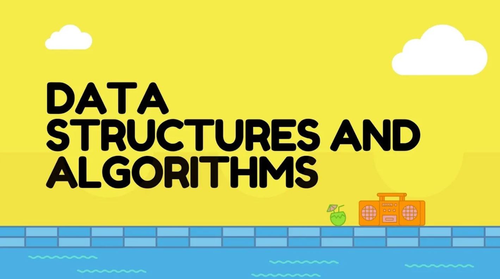

#  Data Structures and Algorithms (DSA) Repository

  

This repository contains well-structured implementations and problem-solving approaches for **Data Structures and Algorithms (DSA)**.  
The aim is to provide organized solutions for practice, learning, and interview preparation.

---

##  Why DSA is Important?

- **Foundation of Programming:** DSA is the backbone of writing efficient code.  
- **Optimized Problem Solving:** Helps in solving real-world problems within given time and memory constraints.  
- **Scalability:** Efficient algorithms and structures allow software systems to scale smoothly.  
- **Thinking Ability:** Improves logical and analytical thinking for approaching problems step by step.

>  Fun Fact: Google, Amazon, Microsoft, and almost every top tech company assess candidates primarily on **DSA skills** during interviews.

---

##  Folder Structure

The repository is divided into topic-specific folders, each with interesting insights:

1. [**Array**](./Array)  
   - Stores elements in contiguous memory locations.  
   - Provides **O(1)** access time for elements.  
   - Basis of higher-level structures like matrices and hash tables.  
   - Fun fact: The term *array* was introduced in the 1950s during early FORTRAN development.  

2. [**String**](./String)  
   - Sequence of characters, essential for text processing.  
   - Used in search engines, DNA sequencing, and compilers.  
   - Famous algorithms: KMP, Rabin-Karp, Z-algorithm.  
   - Fun fact: Strings are one of the most memory-heavy structures in Java!  

3. [**Linked-List**](./Linked-List)  
   - Dynamic memory allocation with nodes connected via pointers.  
   - Used in implementing stacks, queues, and adjacency lists in graphs.  
   - Supports constant-time insertion/deletion at the ends.  
   - Fun fact: The concept was first introduced by **Allen Newell, Cliff Shaw, and Herbert Simon** in 1956.  

4. [**Stack**](./Stack)  
   - Follows **LIFO (Last In First Out)** principle.  
   - Applications: Expression evaluation, undo operations, function call stack.  
   - Fun fact: The word "stack" comes from the analogy of stacking plates!  

5. [**Queue**](./Queue)  
   - Follows **FIFO (First In First Out)** principle.  
   - Applications: CPU scheduling, data buffering, order processing.  
   - Variants: Circular queue, Deque, Priority queue.  
   - Fun fact: Printers internally use queues to manage print jobs.  

6. [**Recursion**](./Recursion)  
   - A function calling itself to solve smaller instances.  
   - Used in divide-and-conquer algorithms like Merge Sort, Quick Sort.  
   - Fun fact: Recursion is deeply connected with mathematical induction.  

7. [**Backtracking**](./Backtracking)  
   - Trial-and-error algorithm to explore all possibilities.  
   - Famous problems: N-Queens, Sudoku Solver, Rat in a Maze.  
   - Fun fact: Backtracking is often described as **"depth-first search with pruning"**.  

8. [**Searching and Sorting**](./Searching%20and%20Sorting)  
   - Essential algorithms for ordered data manipulation.  
   - Famous sorts: Merge Sort, Quick Sort, Heap Sort.  
   - Fun fact: The fastest general-purpose sorting algorithm in practice is **Timsort** (used in Python & Java).  

9. [**Tree**](./Tree)  
   - Hierarchical structure with a root and children.  
   - Used in databases (B-trees), compilers (syntax trees), AI (decision trees).  
   - Fun fact: A **full binary tree** with `n` internal nodes always has `n+1` leaf nodes.  

10. [**Graph**](./Graph)  
    - Represents relationships between entities (nodes and edges).  
    - Applications: Maps, networks, social media, recommendation systems.  
    - Famous algorithms: BFS, DFS, Dijkstra’s, Kruskal’s, Prim’s.  
    - Fun fact: Facebook’s "People You May Know" feature is powered by **graph algorithms**.  

---

##  Tech Stack
- **Language:** C++ (primary)  
- May include solutions in other languages for comparison (Python/Java).  
